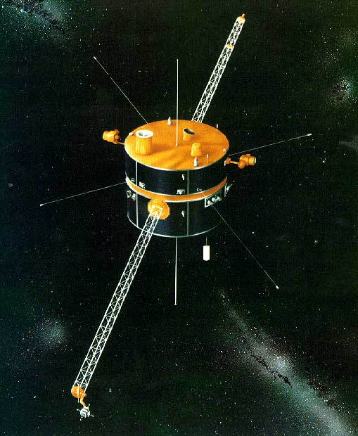
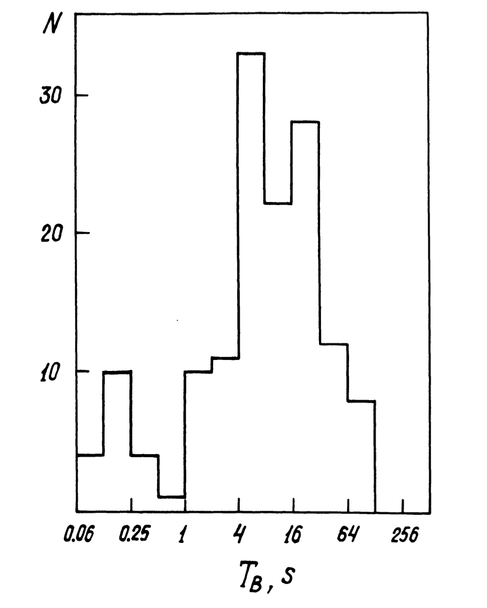
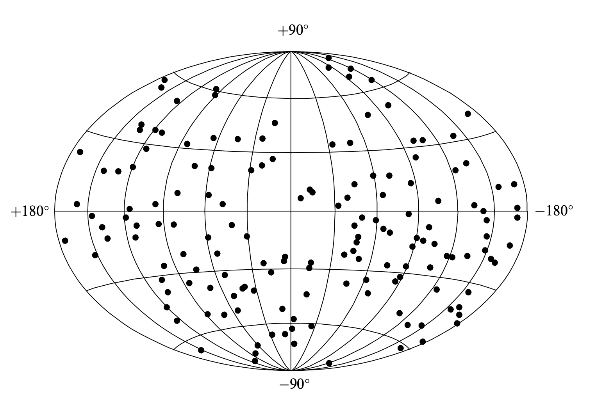
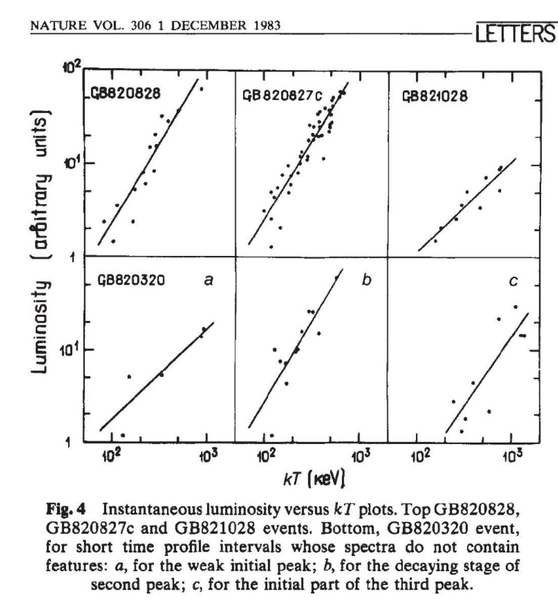

## Send a request for the Konus-Wind data

<form 
  action="https://formspree.io/f/xwpqozev" 
  method="POST"
  class="contact-form"
>
  <label>
    Your name:
    <input type="text" name="name" required>
  </label>
  
  <label>
    Email:
    <input type="email" name="_replyto" required>
  </label>
  
  <label>
    Message:
    <textarea name="message" rows="5" required></textarea>
  </label>
  
  <input type="hidden" name="_language" value="ru">
  
  <button type="submit">Send</button>
</form>

## Instrument
Konus-Wind (hereafter KW; [Aptekar et al. 1995](https://ui.adsabs.harvard.edu/abs/1995SSRv...71..265A/abstract)) is a gamma-ray spectrometer designed to study temporal and spectral characteristics of gamma-ray bursts (GRBs), solar flares (SFs), soft-gamma repeater bursts (SGRs), and other transient phenomena over a wide energy range from 13 keV to 10 MeV, nominally (i.e., at launch; see the end of this section). 
It consists of two identical omnidirectional NaI(Tl) detectors, mounted on opposite faces of the rotationally stabilized Wind spacecraft. 
One detector (S1) points toward the south ecliptic pole, thereby observing the south ecliptic hemisphere; the other (S2) observes the north ecliptic hemisphere. 
Each detector has an effective area of ∼80–160 cm2, depending on the photon energy and incident angle.
Check out [this paper](https://ui.adsabs.harvard.edu/abs/1995SSRv...71...23H/abstract) to get more details on the spacecraft design.

### Orbit
As for now, the instrument operates in orbit around the Lagrange point L1.
In interplanetary space far outside the Earthʼs magnetosphere, KW has the advantages over Earth-orbiting GRB monitors of continuous coverage, uninterrupted by Earth occultation, and a steady background, undistorted by passages through Earthʼs trapped radiation, and subject only to occasional solar particle events. 
The Wind distance from Earth as a function of time is presented in [Palʼshin et al. (2013);](https://ui.adsabs.harvard.edu/abs/2013ApJS..207...38P/abstract) it ranges up to 7&nbsp;lt-s.

### Operational modes
The instrument has two operational modes: waiting and triggered. 
While in the waiting mode, the count rates are recorded in three energy windows G1 (13–50keV), G2 (50–200 keV), and G3 (200–760 keV) with 2.944 s time resolution. 
When the count rate in the G2 window exceeds a ~9 sigma threshold above the background on one of two fixed timescales of 1 s or 140 ms, the instrument switches into the triggered mode, for which the waiting-mode data are also available up to T0+250 s. 
In the triggered mode, the count rates in the three energy windows are recorded with time resolutions varying from 2 ms up to 256 ms. 
These time histories, with a total duration of ∼230 s, also include 0.512 s of pre-trigger history. 
Spectral measurements are carried out, starting from the trigger time T0, in two overlapping energy intervals, PHA1 (13–760 keV) and PHA2 (160 keV–10 MeV), with 64 spectra being recorded for each interval over a 63-channel, pseudo-logarithmic, energy scale. 
The first four spectra are measured with a fixed accumulation time of 64 ms in order to study short bursts. 
For the subsequent 52 spectra, an adaptive system determines the accumulation times, which may vary from 0.256 to 8.192 s depending on the current count rate in the G2 window. 
The last 8 spectra are obtained for 8.192 s each. 
As a result the minimum duration of spectral measurements is 79.104s, and the maximum is 491.776s (which is ∼260s longer than the time history duration). 
After the triggered-mode measurements are finished, KW switches into the data-readout mode for ∼1 hr and no measurements are available for this time interval.

|                                   |**Triggered**                   |**Non-triggered**| **Housekeeping** |
|:------------------------------------------|:---------------------------------------|:-----------------|:------------|
|**Light curve** accumulation time   |  T0-0.512 s to ~T0+230 s         |Continuous\* |Continuous\*|
|**Light curve** time resilution     |  T0-0.512 s to T0+0.512 s: 2 ms T0+0.512 s to ~T0+32 s: 16 ms ~T0+32 s to ~T0+90 s: 64 ms from ~T0+90 s: 256 ms    |  2.944 s     |  3.68 s  |
|**Light curve** energy band        |  G1, G2, G3                      |  G1, G2, G3   |  G2 |
|**Spectral data** range              |  PHA1 (13-760 keV\*\*) PHA2 (160 keV–10 MeV\*\*)  |  Not available but you can use the 3-ch light curve |  Not available |
|**Spectral data** time resolution    |  Spectra 1-4: 64 ms Spectra 5-56: 0.256-8.192 s Spectra 57-64: 8.192 s | 2.944 s| | 

\* Also available in the triggered mode.

\** Nominal values: correspond to the date of the launch.

### Dead time correction
For all the bursts, we used a standard KW dead time (DT) correction procedure for light curves (with a DT of a few μs) and spectra (with a DT of ∼42 μs). 

### DRM
The detector response matrix (DRM), which is a function only of the burst angle relative to the instrument axis, was computed using the GEANT4 package (Agostinelli et al. 2003). 
The detailed description of the instrument response calculation is presented in [Terekhov et al. (1998)](https://ui.adsabs.harvard.edu/abs/1998AIPC..428..894T/abstract). 
The latest version of the DRM contains responses calculated for 264 photon energies between 5 keV and 30 MeV on a quasi-logarithmic scale for incident angles from 0º to 100º with a step of 5º. 
The energy scale is calibrated in flight using the 1460keV line of 40K and the 511 keV e+e− annihilation line. 
The gain of the detectors has slowly decreased during the long period of operation. 
The instrumental control of the gain became non-functional in 1997 and the spectral range changed to 25 keV–18 MeV for the S1 detector and to 20 keV–15 MeV for the S2 detector, from the original 13 keV–10 MeV; the G1, G2, G3, PHA1, and PHA2 energy bounds shifted accordingly.

The consistency of the KW spectral parameters and those obtained in other GRB experiments was verified by a cross-calibration with Swift-BAT and Suzaku-WAM [(Sakamoto et al. 2011b,)](https://ui.adsabs.harvard.edu/abs/2011PASJ...63..215S/abstract) and in joint spectral fits with Fermi-GBM. 
It was shown that the difference in the spectrum normalization between KW and these instruments is <20% in joint fits. 

#### Check out [Tsvetkova+ (2022)](https://ui.adsabs.harvard.edu/abs/2022Univ....8..373T/abstract) for a comprehensive review of the key space and gound facilities in GRB science.

## Catalogs and Databases
- [Collection of GCNs](https://gcn.nasa.gov/circulars?view=index&query=subject%3A%22Konus%22&startDate=&endDate=)
- [Triggered events](http://www.ioffe.ru/LEA/kw/triggers/)
- [Non-triggered events](http://www.ioffe.ru/LEA/kw/wm/)
- GRBs with redshifts: [triggered](http://www.ioffe.ru/LEA/zGRBs/triggered/index.html) and [non-triggered+BAT](http://www.ioffe.ru/LEA/zGRBs/part2/index.html)
- [The Second Catalog of IPN Localizations of KW Short GRBs](http://www.ioffe.ru/LEA/ShortGRBs_IPN/index.html) &nbsp;&nbsp;&nbsp; [the paper](https://ui.adsabs.harvard.edu/abs/2022ApJS..259...34S/abstract)
- Short GRBs: [1994-2010](http://www.ioffe.ru/LEA/shortGRBs/Catalog2/index.html) and [2011-2021](http://www.ioffe.ru/LEA/shortGRBs/Catalog3/index.html)
- SGRs: [1978-2000](http://www.ioffe.ru/LEA/SGR/Catalog/index.html), [Online Magnetar Catalog](https://www.ioffe.ru/LEA/SGR/index.html)
- SFs: [KW+GOES](http://www.ioffe.ru/LEA/Solar/index.html), [KW-Sun triggered](http://www.ioffe.ru/LEA/kwsun/index.html), [KW-Sun non-triggered](http://www.ioffe.ru/LEA/kwsun_waiting/index.html), [KW+STIX](http://www.ioffe.ru/LEA/kw_stix/index.html), [KW+SSRT](http://www.ioffe.ru/LEA/SF_AR/KW-SSRT/index.html), [BTL](http://www.ioffe.ru/LEA/kw/wm/btl/index.html)
- FRBs: [targeted search for counterparts](http://www.ioffe.ru/LEA/FRB/index.html) &nbsp;&nbsp;&nbsp; [the paper](https://ui.adsabs.harvard.edu/abs/2024MNRAS.527.5580R/abstract)

{: width="500px"}

## Historical remarks
Key results of the KONUS experiment aboard Venera 11-14 spacecrafts: 
- Bimodal duration distribution of GRBs (TB is the GRB duration, N is the number of events) suggesting their various physical origins. [The paper.](https://ui.adsabs.harvard.edu/abs/1981Ap%26SS..80....3M/abstract)
    [{: width="300px"}](https://ui.adsabs.harvard.edu/abs/1981Ap%26SS..80....3M/abstract)
  
- Isotropic sky distribution of GRBs suggesting their extragalactic origin. [The paper.](https://ui.adsabs.harvard.edu/abs/1981Ap%26SS..80....3M/abstract)
  
    [{: width="500px"}](https://ui.adsabs.harvard.edu/abs/2019PhyU...62..739A/abstract)
  
- Correlation between the intensity of GRB emission and its spectral hardness in the same burst (the "Golenetskii relation"). [The paper.](https://ui.adsabs.harvard.edu/abs/1983Natur.306..451G/abstract)
  [{: width="500px"}](https://ui.adsabs.harvard.edu/abs/1983Natur.306..451G/abstract)
  
Check out [this paper](https://ui.adsabs.harvard.edu/abs/2019PhyU...62..739A/abstract) for more details.
