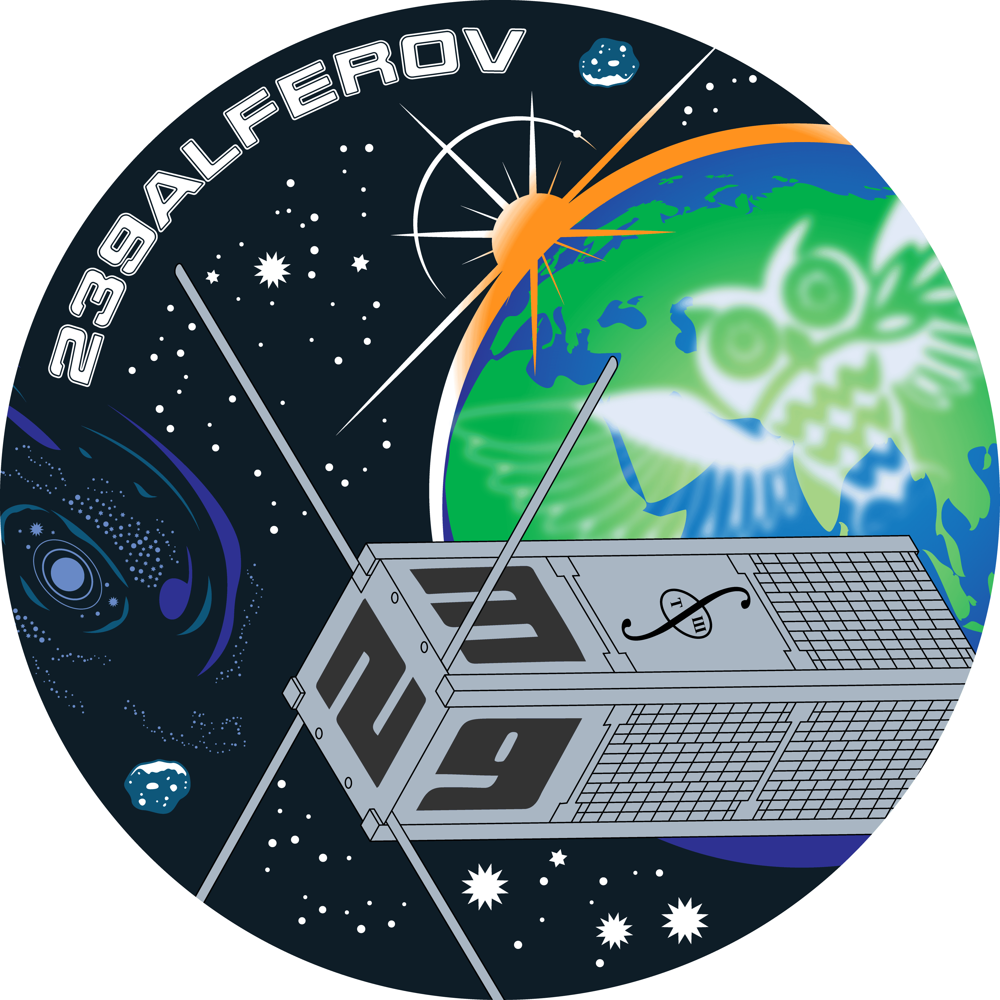

## News & Updates

### July 2026
- A 3U cubesat [239Alferov](https://spacepi.space/satellites/239-alferov/) carrying a 50 cm2 NaI gamma-spectrometer aimed at the detection of transients has been launched on July 25th. The monitor is designed to study sources of gamma radiation of extragalactic (gamma-ray bursts), galactic (flashes of neutron stars), solar (solar flares), and terrestrial origin (terrestrial gamma flashes). The payload development was directed by the [KW team](http://www.ioffe.ru/LEA/index.html). Working with 239Alferov, called after the Nobel prize winner [Zhores Alferov](https://www.nobelprize.org/prizes/physics/2000/alferov/facts/), students will gain knowledge about the current tasks of modern high-energy astrophysics, get acquainted with the methods and approaches of creating gamma detectors and analyzing their data. The skills acquired by students in the course of working with a payload will help to involve them in scientific, innovative, and project activities in the field of space instrumentation and data analysis.
  
[{: width="300px"}](https://spacepi.space/satellites/239-alferov/)
- Our manuscript entitled "Time-resolved spectro-polarimetric analysis of extremely bright GRB 230307A: Possible Evidence of evolution from photospheric to synchrotron dominated emission" has been accepted for publication in A&A. 
- A  very bright, long-duration GRB 250706B/C has been detected by [SVOM/ECLAIRs](https://gcn.nasa.gov/circulars/40989), [Fermi-LAT](https://gcn.nasa.gov/circulars/41019), [Konus-Wind](https://gcn.nasa.gov/circulars/41027), and [Insight-HXMT/HE](https://gcn.nasa.gov/circulars/41049). Several optical telescopes observed the field of the GRB, among which VLT/X-shooter was able to securely identify its redshift z = [0.942](https://gcn.nasa.gov/circulars/41022). The analysis of this event is ongoing.

### June 2025
- Our paper [Gamma-ray burst taxonomy: Looking for the third class on the spectral peak energy-duration plane in the rest frame](https://ui.adsabs.harvard.edu/abs/2025A%26A...698A.169T/abstract) has been published in A&A.
- Our paper [The third Konus-Wind catalogue of short gamma-ray bursts](https://ui.adsabs.harvard.edu/abs/2025PASA...42...63L/abstract) has been published in PASA.
- Our paper [Investigating polarization characteristics of GRB 200503A and GRB 201009A](https://ui.adsabs.harvard.edu/abs/2025JApA...46...38S/abstract) has been published in JApA

### May 2025
- Our paper [A search for periodic activity in multi-peaked long gamma-ray bursts](https://ui.adsabs.harvard.edu/abs/2025A%26A...697A.228G/abstract) has been published in A&A.
- Our paper [High energy time lags of gamma-ray bursts](https://ui.adsabs.harvard.edu/abs/2025A%26A...697A.161M/abstract) has been published in A&A.

### April 2025
- Our paper [Soft X-ray prompt emission from the high-redshift gamma-ray burst EP240315a](https://ui.adsabs.harvard.edu/abs/2025NatAs...9..564L/abstract) has been published in Nat. Astr.

### March 2025
[HERMES-SP](https://www.hermes-sp.eu) (High Energy Rapid Modular Ensemble of Satellites - Scientific Pathfinder), a constellation of six nano-satellites hosting new miniaturized detectors to probe the X-ray temporal emission of bright high-energy transients such as GRBs and the electromagnetic counterparts of Gravitational Wave Events (GWE), has been launched to the low Earth orbit (LEO) on March 25th. [{: height="30px"}](https://www.youtube.com/watch?v=tRWqsYq2Rc8)

