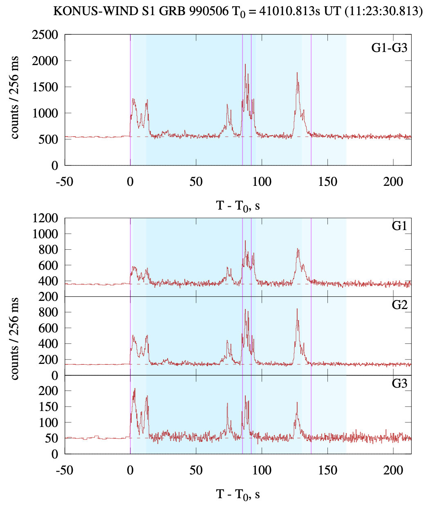

## Selected Research Projects

### Primary Research Area

[**KW GRBs with known redshifts detected in the triggered mode**](https://ui.adsabs.harvard.edu/abs/2017ApJ...850..161T/abstract)

[{: width="300px"}](https://ui.adsabs.harvard.edu/abs/2017ApJ...850..161T/abstract)

See the abstract

In this catalog, we present the results of a systematic study of gamma-ray bursts (GRBs) with reliable redshift estimates detected in the triggered mode of the Konus-Wind (KW) experiment during the period from 1997 February to 2016 June. The sample consists of 150 GRBs (including 12 short/hard bursts) and represents the largest set of cosmological GRBs studied to date over a broad energy band. From the temporal and spectral analyses of the sample, we provide the burst durations, the spectral lags, the results of spectral fits with two model functions, the total energy fluences, and the peak energy fluxes. Based on the GRB redshifts, which span the range 0.1≤slant z≤slant 5, we estimate the rest-frame, isotropic-equivalent energy, and peak luminosity. For 32 GRBs with reasonably constrained jet breaks, we provide the collimation-corrected values of the energetics. We consider the behavior of the rest-frame GRB parameters in the hardness-duration and hardness-intensity planes, and confirm the “Amati” and “Yonetoku” relations for Type II GRBs. The correction for the jet collimation does not improve these correlations for the KW sample. We discuss the influence of instrumental selection effects on the GRB parameter distributions and estimate the KW GRB detection horizon, which extends to z∼ 16.6, stressing the importance of GRBs as probes of the early universe. Accounting for the instrumental bias, we estimate the KW GRB luminosity evolution, luminosity and isotropic-energy functions, and the evolution of the GRB formation rate, which are in general agreement with those obtained in previous studies.

# &nbsp;

<!--
| **KW GRBs with known redshifts detected 
in the triggered mode** | **KW GRBs with known redshifts detected in the waiting mode and by Swift/BAT** |
|  |  |
| 

See the abstract

In this catalog, we present the results of a systematic study of gamma-ray bursts (GRBs) with reliable redshift estimates detected in the triggered mode of the Konus-Wind (KW) experiment during the period from 1997 February to 2016 June. The sample consists of 150 GRBs (including 12 short/hard bursts) and represents the largest set of cosmological GRBs studied to date over a broad energy band. From the temporal and spectral analyses of the sample, we provide the burst durations, the spectral lags, the results of spectral fits with two model functions, the total energy fluences, and the peak energy fluxes. Based on the GRB redshifts, which span the range 0.1≤slant z≤slant 5, we estimate the rest-frame, isotropic-equivalent energy, and peak luminosity. For 32 GRBs with reasonably constrained jet breaks, we provide the collimation-corrected values of the energetics. We consider the behavior of the rest-frame GRB parameters in the hardness-duration and hardness-intensity planes, and confirm the “Amati” and “Yonetoku” relations for Type II GRBs. The correction for the jet collimation does not improve these correlations for the KW sample. We discuss the influence of instrumental selection effects on the GRB parameter distributions and estimate the KW GRB detection horizon, which extends to z∼ 16.6, stressing the importance of GRBs as probes of the early universe. Accounting for the instrumental bias, we estimate the KW GRB luminosity evolution, luminosity and isotropic-energy functions, and the evolution of the GRB formation rate, which are in general agreement with those obtained in previous studies.

| 

See the abstract

In this catalog, we present the results of a systematic study of gamma-ray bursts (GRBs) with reliable redshift estimates detected in the triggered mode of the Konus-Wind (KW) experiment during the period from 1997 February to 2016 June. The sample consists of 150 GRBs (including 12 short/hard bursts) and represents the largest set of cosmological GRBs studied to date over a broad energy band. From the temporal and spectral analyses of the sample, we provide the burst durations, the spectral lags, the results of spectral fits with two model functions, the total energy fluences, and the peak energy fluxes. Based on the GRB redshifts, which span the range 0.1≤slant z≤slant 5, we estimate the rest-frame, isotropic-equivalent energy, and peak luminosity. For 32 GRBs with reasonably constrained jet breaks, we provide the collimation-corrected values of the energetics. We consider the behavior of the rest-frame GRB parameters in the hardness-duration and hardness-intensity planes, and confirm the “Amati” and “Yonetoku” relations for Type II GRBs. The correction for the jet collimation does not improve these correlations for the KW sample. We discuss the influence of instrumental selection effects on the GRB parameter distributions and estimate the KW GRB detection horizon, which extends to z∼ 16.6, stressing the importance of GRBs as probes of the early universe. Accounting for the instrumental bias, we estimate the KW GRB luminosity evolution, luminosity and isotropic-energy functions, and the evolution of the GRB formation rate, which are in general agreement with those obtained in previous studies.

 |
-->

[**KW GRBs with known redshifts detected in the waiting mode and by Swift/BAT**](https://ui.adsabs.harvard.edu/abs/2021ApJ...908...83T/abstract)

[{: width="300px"}](https://ui.adsabs.harvard.edu/abs/2021ApJ...908...83T/abstract)

See the abstract

In the second part of The Konus-Wind Catalog of Gamma-Ray Bursts with Known Redshifts (the first part: Tsvetkova et al. 2017; T17), we present the results of a systematic study of gamma-ray bursts (GRBs) with reliable redshift estimates detected simultaneously by the Konus-Wind (KW) experiment (in the waiting mode) and by the Swift/BAT (BAT) telescope during the period from 2005 January to the end of 2018. By taking advantage of the high sensitivity of BAT and the wide spectral band of KW, we were able to constrain the peak spectral energies, the broadband energy fluences, and the peak fluxes for the joint KW-BAT sample of 167 weak, relatively soft GRBs (including four short bursts). Based on the GRB redshifts, which span the range 0.04 ≤ z ≤ 9.4, we estimate the rest frame, isotropic-equivalent energy, and peak luminosity. For 14 GRBs with reasonably constrained jet breaks, we provide the collimation-corrected values of the energetics. This work extends the sample of KW GRBs with known redshifts to 338 GRBs, the largest set of cosmological GRBs studied to date over a broad energy band. With the full KW sample, accounting for the instrumental bias, we explore GRB rest-frame properties, including hardness-intensity correlations, GRB luminosity evolution, luminosity and isotropic-energy functions, and the evolution of the GRB formation rate, which we find to be in general agreement with those reported in T17 and other previous studies.

# &nbsp;

[**2D Classification of GRBs in their rest-frame**](https://ui.adsabs.harvard.edu/abs/2025A%26A...698A.169T/abstract)

[{: width="300px"}](https://ui.adsabs.harvard.edu/abs/2025A%26A...698A.169T/abstract)

See the abstract

Context. Two classes of gamma-ray bursts (GRBs) corresponding to the short-hard and the long-soft events, with a putative intermediate class, are typically considered in the observer frame. However, when considering GRB characteristics in the cosmological rest frame, the boundary between the classes becomes blurred. Aims. The goal of this research is to check for evidences of a third 'intermediate' class of GRBs and investigate how the transformation from the observer to the rest frame affects the hardness-duration-based classification. Methods. We applied fits with skewed and non-skewed (symmetric) Gaussian and Student distributions to a sample of 409 GRBs with reliably measured redshifts to cluster the bursts on the hardness (Ep) – duration (T90) plane. Results. We find that based on AIC/BIC criteria, the statistically preferred number of clusters on the GRB rest-frame hardness-duration plane does not exceed two. We also assessed the robustness of the clustering technique. Conclusions. We did not find any solid evidence of an intermediate GRB class on the rest-frame hardness-duration plane.

# &nbsp;

[**The main facilities detecting GRBs across all wavelengths**](https://ui.adsabs.harvard.edu/abs/2022Univ....8..373T/abstract)

[{: width="300px"}](https://ui.adsabs.harvard.edu/abs/2022Univ....8..373T/abstract)

See the abstract

Gamma-ray bursts (GRBs) are short and intense flashes of γ-rays coming from deep space. GRBs were discovered more than a half century ago and now are observed across the whole electromagnetic spectrum from radio to very-high-energy gamma rays. They carry information about the powerful energy release during the final stage of stellar evolution, as well as properties of matter on the way to the observer. At present, space-based observatories detect on average approximately one GRB per day. In this review, we summarize key space and ground facilities that contribute to the GRB studies.

# &nbsp;
[**How can we witness the Lorentz Invariance violation with GRBs?**](https://ui.adsabs.harvard.edu/abs/2023Univ....9..359T/abstract)

[{: width="300px"}](https://ui.adsabs.harvard.edu/abs/2023Univ....9..359T/abstract)

See the abstract

According to Einstein's special relativity theory, the speed of light in a vacuum is constant for all observers. However, quantum gravity effects could introduce its dispersion depending on the energy of photons. The investigation of the spectral lags between the gamma-ray burst (GRB) light curves recorded in distinct energy ranges could shed light on this phenomenon: the lags could reflect the variation of the speed of light if it is linearlydependent on the photon energy and a function of the GRB redshift. We propose a methodology to start investigating the dispersion law of light propagation in a vacuum using GRB light curves. This technique is intended to be fully exploited using the GRB data collected with THESEUS.

# &nbsp;

<!--#### Related Publications
- Paper Title (Year) [Link](#)
- Paper Title (Year) [Link](#)-->

### Secondary Research Area
<!-- - [Soft X-ray prompt emission from the high-redshift gamma-ray burst EP240315a](https://ui.adsabs.harvard.edu/abs/2025NatAs...9..564L/abstract)-->
- [A peculiar hard X-ray counterpart of a Galactic fast radio burst](https://ui.adsabs.harvard.edu/abs/2021NatAs...5..372R/abstract)

See the abstract

Fast radio bursts (FRBs) are bright, millisecond-scale radio flashes of unknown physical origin. Young, highly magnetized, isolated neutron stars—magnetars—have been suggested as the most promising candidates for FRB progenitors owing to their energetics and high X-ray flaring activity. Here we report the detection with Konus-Wind of a hard X-ray event of 28 April 2020 temporally coincident with a bright, two-peak radio burst4,5 in the direction of Galactic magnetar SGR 1935+2154, with properties remarkably similar to those of FRBs. We show that the two peaks of the double-peaked X-ray burst coincide in time with the radio peaks and infer a common source and the association of these phenomena. An unusual hardness of the X-ray spectrum strongly distinguishes the 28 April event among multiple `ordinary' flares from SGR 1935+2154. A recent non-detection of radio emission from about 100 typical soft bursts from SGR 1935+2154 favours the idea that bright, FRB-like magnetar signals are associated with rare, hard-spectrum X-ray bursts. The implied rate of these hard X-ray bursts (~0.04 yr−1 magnetar−1) appears consistent with the rate estimate4 of SGR 1935+2154-like radio bursts (0.007-0.04 yr−1 magnetar−1).

- [A bright γ-ray flare interpreted as a giant magnetar flare in NGC 253](https://ui.adsabs.harvard.edu/abs/2021Natur.589..211S/abstract)

See the abstract

Soft γ-ray repeaters exhibit bursting emission in hard X-rays and soft γ-rays. During the active phase, they emit random short (milliseconds to several seconds long), hard-X-ray bursts, with peak luminosities of 10^36 to 10^43 erg per second. Occasionally, a giant flare with an energy of around 10^44 to 10^46 erg is emitted. These phenomena are thought to arise from neutron stars with extremely high magnetic fields (10^14 to 10^15 gauss), called magnetars. A portion of the second-long initial pulse of a giant flare in some respects mimics short γ-ray bursts, which have recently been identified as resulting from the merger of two neutron stars accompanied by gravitational-wave emission. Two γ-ray bursts, GRB 051103 and GRB 070201, have been associated with giant flares. Here we report observations of the γ-ray burst GRB 200415A, which we localized to a 20-square-arcmin region of the starburst galaxy NGC 253, located about 3.5 million parsecs away. The burst had a sharp, millisecond-scale hard spectrum in the initial pulse, which was followed by steady fading and softening over 0.2 seconds. The energy released (roughly 1.3 × 10^46 erg) is similar to that of the superflare from the Galactic soft γ-ray repeater SGR 1806-20 (roughly 2.3 × 10^46 erg). We argue that GRB 200415A is a giant flare from a magnetar in NGC 253.

- [A Search for Gravitationally Lensed Gamma-Ray Bursts in the Data of the Interplanetary Network and Konus-Wind](https://ui.adsabs.harvard.edu/abs/2019ApJ...871..121H/abstract)

See the abstract

We examine a sample of 2301 gamma-ray bursts, detected by Konus-Wind in the triggered mode between 1994 and 2017 and localized by the interplanetary network (IPN), for evidence of gravitational lensing. We utilize all the available gamma-ray burst (GRB) data: time histories, localizations, and energy spectra. We employ common IPN techniques to find and quantify similarities in the light curves of 2,646,150 burst pairs, and for the pairs with significant similarities, we examine their IPN localizations to determine whether they are consistent with a common origin. For pairs that are consistent, we derive and compare energy spectra, and compute a figure of merit that allows us to compare and rank burst pairs. We conduct both a blind search, between all possible burst pairs, and a targeted search, between pairs in which one burst has both a spectroscopic redshift and an identification of an intervening system, as measured by one or more lower spectroscopic redshifts. We identify six pairs in the blind search that could be taken as evidence for lensing, but none are compelling enough to claim a detection with good confidence. No candidates were detected in the targeted search. For our GRB sample, we set an upper limit to the optical depth to lensing of 0.0033, which is comparable to that of optical sources. We conclude that proposed scenarios in which a large fraction of the GRB population is lensed are extremely unlikely.

- [Discovery and confirmation of the shortest gamma-ray burst from a collapsar](https://ui.adsabs.harvard.edu/abs/2021NatAs...5..917A/abstract)

See the abstract

GRBs are among the brightest and most energetic events in the Universe. The duration and hardness distribution of GRBs has two clusters, now understood to reflect (at least) two different progenitors. Short-hard GRBs (SGRBs; T90 < 2 s) arise from compact binary mergers, and long-soft GRBs (LGRBs; T90 > 2 s) have been attributed to the collapse of peculiar massive stars (collapsars). The discovery of SN 1998bw/GRB 980425 marked the first association of an LGRB with a collapsar, and AT 2017gfo/GRB 170817A/GW170817 marked the first association of an SGRB with a binary neutron star merger, which also produced a gravitational wave. Here, we present the discovery of ZTF20abwysqy (AT2020scz), a fast-fading optical transient in the Fermi satellite and the Interplanetary Network localization regions of GRB 200826A; X-ray and radio emission further confirm that this is the afterglow. Follow-up imaging (at rest-frame 16.5 days) reveals excess emission above the afterglow that cannot be explained as an underlying kilonova, but which is consistent with being the supernova. Although the GRB duration is short (rest-frame T90 of 0.65 s), our panchromatic follow-up data confirm a collapsar origin. GRB 200826A is the shortest LGRB found with an associated collapsar; it appears to sit on the brink between a successful and a failed collapsar. Our discovery is consistent with the hypothesis that most collapsars fail to produce ultra-relativistic jets.

- [Soft X-ray prompt emission from the high-redshift gamma-ray burst EP240315a](https://ui.adsabs.harvard.edu/abs/2025NatAs...9..564L/abstract)

See the abstract

Long gamma-ray bursts (GRBs) are believed to originate from core collapse of massive stars. High-redshift GRBs can probe the star formation and reionization history of the early Universe, but their detection remains rare. Here we report the detection of a GRB triggered in the 0.5-4 keV band by the Wide-field X-ray Telescope (WXT) on board the Einstein Probe (EP) mission, designated as EP240315a, whose bright peak was also detected by the Swift Burst Alert Telescope and Konus-Wind through off-line analyses. At a redshift of z = 4.859, EP240315a showed a much longer and more complicated light curve in the soft-X-ray band than in gamma rays. Benefiting from a large field of view (~3,600°2) and a high sensitivity, EP-WXT captured the earlier engine activation and extended late engine activity through a continuous detection. With a peak X-ray flux at the faint end of previously known high-z GRBs, the detection of EP240315a demonstrates the great potential for EP to study the early universe via GRBs.

- [Long gamma-ray burst light curves as the result of a common stochastic pulse–avalanche process](https://ui.adsabs.harvard.edu/abs/2024A%26A...689A.266B/abstract)

See the abstract

Context. The complexity and variety exhibited by the light curves of long gamma-ray bursts (GRBs) enclose a wealth of information that has not yet been fully deciphered. Despite the tremendous advance in the knowledge of the energetics, structure, and composition of the relativistic jet that results from the core collapse of the progenitor star, the nature of the inner engine, how it powers the relativistic outflow, and the dissipation mechanisms remain open issues. Aims. A promising way to gain insights is describing GRB light curves as the result of a common stochastic process. In the Burst And Transient Source Experiment (BATSE) era, a stochastic pulse avalanche model was proposed and tested through the comparison of ensemble-average properties of simulated and real light curves. Here our aim was to revive and further test this model. Methods. We applied it to two independent datasets, BATSE and Swift/BAT, through a machine learning approach: the model parameters are optimised using a genetic algorithm. Results. The average properties were successfully reproduced. Notwithstanding the different populations and passbands of both datasets, the corresponding optimal parameters are interestingly similar. In particular, for both sets the dynamics appear to be close to a critical state, which is key to reproducing the observed variety of time profiles. Conclusions. Our results propel the avalanche character in a critical regime as a key trait of the energy release in GRB engines, which underpins some kind of instability.

- [KW-Sun: The Konus-Wind Solar Flare Database in Hard X-Ray and Soft Gamma-Ray Ranges](https://ui.adsabs.harvard.edu/abs/2022ApJS..262...32L/abstract)

See the abstract

We present a database of solar flares registered by the Konus-Wind instrument during more than 27 yr of operation, from 1994 November to now (2022 June). The constantly updated database (hereafter KW-Sun) contains over 1000 events detected in the instrument's triggered mode and is accessible online at http://www.ioffe.ru/LEA/kwsun/. For each flare, the database provides time-resolved energy spectra in energy range from ~20 keV to ~15 MeV in FITS format along with count-rate light curves in three wide-energy bands, G1 (~20-80 keV), G2 (~80-300 keV), and G3 (~300-1200 keV), with high time resolution (down to 16 ms) in ASCII and IDL SAV formats. This article focuses on the instrument capabilities in the context of solar observations, the structure of the KW-Sun data, and their intended usage. The presented homogeneous data set obtained in the broad energy range with high temporal resolution during more than two full solar cycles is beneficial for both statistical and case studies as well as a source of context data for solar flare research.

- [HERMES: Gamma-ray burst and gravitational wave counterpart hunter](https://ui.adsabs.harvard.edu/abs/2024A%26A...689A.175G/abstract)

See the abstract

Gamma-ray bursts (GRBs) bridge relativistic astrophysics and multimessenger astronomy. Space–based γ- and X-ray wide-field detectors have proven essential for detecting and localizing the highly variable GRB prompt emission, which is also a counterpart of gravitational wave events. We studied the capability of detecting long and short GRBs with the High Energy Rapid Modular Ensemble of Satellites (HERMES) Pathfinder (HP) and SpIRIT, namely a swarm of six 3U CubeSats to be launched in early 2025, and a 6U CubeSat launched on December 1 2023. We also studied the capabilities of two advanced configurations of swarms of more than eight satellites with improved detector performances (HERMES Constellations). The HERMES detectors, sensitive down to ∼2–3 keV, will be able to detect faint and soft GRBs, which comprise X-ray flashes and high-redshift bursts. By combining state-of-the-art long- and short-GRB population models with a description of the single module performance, we estimate that HP will detect ∼195‑21+22 long GRBs (3.4‑0.8+0.3 at redshift z > 6) and ∼19‑3+5 short GRBs per year. The larger HERMES Constellations under study can detect between ∼1300 and ∼3000 long GRBs per year and between ∼160 and ∼400 short GRBs per year, depending on the chosen configuration, with a rate of long GRBs above z > 6 of between 30 and 75 per year. Finally, we explored the capability of HERMES to detect short GRBs as electromagnetic counterparts of binary neutron star (BNS) mergers detected as gravitational signals by current and future ground–based interferometers. Under the assumption that the GRB jets are structured, we estimate that HP can provide up to ∼1 (14) yr‑1 joint detections during the fifth LIGO–Virgo–KAGRA observing run (Einstein Telescope single triangle 10 km arm configuration). These numbers become ∼4 (100) yr‑1, respectively, for the HERMES Constellation configuration. ⋆ Based on work of the HERMES-Pathfinder collaboration, see list in the Appendix.

- [A proposed network of gamma-ray burst detectors on the global navigation satellite system Galileo G2](https://ui.adsabs.harvard.edu/abs/2022A%26A...664A.131G/abstract)

See the abstract

The accurate localization of gamma-ray bursts (GRBs) remains a crucial task. Historically, improved localizations have led to the discovery of afterglow emission and the realization of their cosmological distribution via redshift measurements; however, a more recent requirement comes with the potential of studying the kilonovae of neutron star mergers. Gravitational wave detectors are expected to provide locations to not better than 10 square degrees over the next decade. With their increasing horizon for merger detections the intensity of the gamma-ray and kilonova emission also drops, making their identification in large error boxes a challenge. Thus, a localization via the gamma-ray emission seems to be the best chance to mitigate this problem. Here we propose to equip some of the second-generation Galileo satellites with dedicated GRB detectors. This saves costs for launches and satellites for a dedicated GRB network, the large orbital radius is beneficial for triangulation, and perfect positional and timing accuracy come for free. We present simulations of the triangulation accuracy, demonstrating that short GRBs as faint as GRB 170817A can be localized to 1 degree radius (1σ).

<!--#### Related Publications
- Paper Title (Year) [Link](#)-->

### Current Projects
**KW + BeppoSAX/WFC looking together towards synchrotron emission in GRBs**

{: width="300px"}

The combination of Konus-Wind (KW) (20 keV–15 MeV) and BeppoSAX/WFC (2–28 keV) provideы a broadband spectral coverage crucial for identifying synchrotron radiation as the dominant emission mechanism in GRB prompt phases. 
It also allows studies of multi-component GRB emission.
Currently, we are finishing joint analysis of a couple of dozen of GRBs with phenomenological spectral models implying both thermal and non-thermal radiation.

# &nbsp;

**Multi-Dimensional Classification of GRBs in their rest-frame**

{: width="300px"}

Moving beyond the simplistic long-soft/short-hard dichotomy, multi-dimensional rest-frame classification reveals a richer GRB taxonomy linked to progenitors, central engines, and jet physics. Machine learning and multi-wavelength data are key to unlocking this complexity.

# &nbsp;

**Minimum Variability Timescale of GRB lightcurves observed by KW**

{: width="300px"}

The minimum variability timescale (MVT) of a GRB refers to the shortest observed time over which significant changes in brightness or flux occur in the gamma-ray light curve. 
This timescale provides crucial insights into the physical size and dynamics of the emission region, as well as the underlying central engine (e.g., a black hole or magnetar).

# &nbsp;

**Cross-calibration of GRB detectors using simultaneously detected bursts**

{: width="300px"}

Since different gamma-ray telescopes have varying energy responses, effective areas, and instrumental systematics, cross-calibration is essential to ensure consistent measurements of GRB properties (e.g., fluence, peak flux, and spectral parameters). 
While most instruments agree within ~10–20%, spectral shape and flux normalization discrepancies can still arise, requiring careful analysis.
The best way to achieve this is by analyzing GRBs detected simultaneously by multiple instruments.

# &nbsp;

<!--
- **Project Title**: Description of the project, funding source, collaborators.
- **Project Title**: Description of the project, funding source, collaborators.
-->

### Research Tools & Resources
[{: width="300px"}](https://github.com/anastasia-tsvetkova/lc_pulse_avalanche)

[`lc_pulse_avalanche`](https://github.com/anastasia-tsvetkova/lc_pulse_avalanche): A piece of code that creates GRB light curve generating a stochastic pulse avalanche according to [Stern & Svensson (1996)](https://ui.adsabs.harvard.edu/abs/1996ApJ...469L.109S/abstract).

# &nbsp;

[{: width="300px"}](https://github.com/anastasia-tsvetkova/make_BAT_PHA_and_slew_corrected_DRM)

[`make_BAT_PHA_and_slew_corrected_DRM`](https://github.com/anastasia-tsvetkova/make_BAT_PHA_and_slew_corrected_DRM): A class in python and a jupyter notebook providing an example of usage. The class includes methods to make pha- and rsp-files from Swift/BAT event files. The DRM-files will be corrected for the s/c slew if necessary.

# &nbsp;

[{: width="300px"}](https://github.com/anastasia-tsvetkova/KW-software)

[`KW-software`](https://github.com/anastasia-tsvetkova/KW-software): Some python scripts and Jupyter notebooks for preprocessing of Konus-Wind data.

# &nbsp;

**KW GRBs with known z part I:** [ASCII data sets and figures](http://www.ioffe.ru/LEA/zGRBs/triggered/) of GRB light curves and XSpec plots of spectral fits for the "Konus-Wind Catalog of Gamma-Ray Bursts with Known Redshifts. I. Bursts Detected in the Triggered Mode".

[{: width="300px"}](http://www.ioffe.ru/LEA/zGRBs/triggered/)

# &nbsp;

**KW GRBs with known z part II:** [ASCII data sets and figures of GRB light curves and XSpec plots of spectral fits](http://www.ioffe.ru/LEA/zGRBs/part2/) for "the Konus-Wind Catalog of Gamma-Ray Bursts with Known Redshifts. II. Waiting Mode Bursts Simultaneously Detected by Swift/BAT".

[{: width="300px"}](http://www.ioffe.ru/LEA/zGRBs/part2/)

### Theses
- [My PhD thesis (in Russian)](assets/docs/Phd_thesis.pdf)
